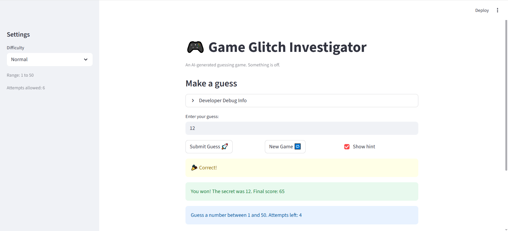
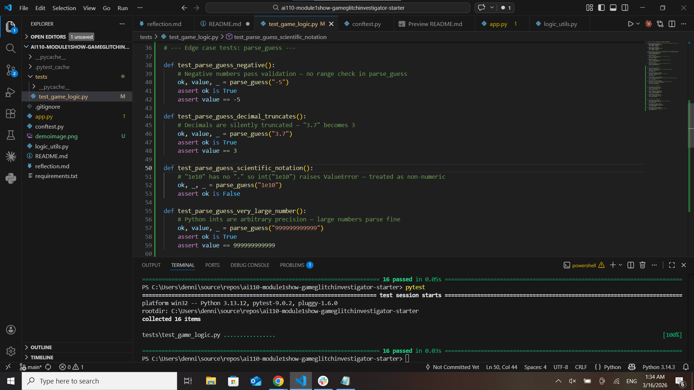

# 🎮 Game Glitch Investigator: The Impossible Guesser

## 🚨 The Situation

You asked an AI to build a simple "Number Guessing Game" using Streamlit.
It wrote the code, ran away, and now the game is unplayable. 

- You can't win.
- The hints lie to you.
- The secret number seems to have commitment issues.

## 🛠️ Setup

1. Install dependencies: `pip install -r requirements.txt`
2. Run the broken app: `python -m streamlit run app.py`

## 🕵️‍♂️ Your Mission

1. **Play the game.** Open the "Developer Debug Info" tab in the app to see the secret number. Try to win.
2. **Find the State Bug.** Why does the secret number change every time you click "Submit"? Ask ChatGPT: *"How do I keep a variable from resetting in Streamlit when I click a button?"*
3. **Fix the Logic.** The hints ("Higher/Lower") are wrong. Fix them.
4. **Refactor & Test.** - Move the logic into `logic_utils.py`.
   - Run `pytest` in your terminal.
   - Keep fixing until all tests pass!

## 📝 Document Your Experience

### [ ] Describe the game's purpose.

The purpose of this game is to guess a certain secret number from within a range of numbers in a limited number of guesses. The range of numbers and number of guesses are increased or decreased depending on the selected difficulty.

### [ ] Detail which bugs you found.

The bugs I found are:
- Incorrect hint directions
- The secret number was cast to a string on even attempts, causing unexpected results with lexicographical comparison
- Guesses that were too high added 5 points on even attempts instead of always decreasing 5 points
- Size of ranges relative to difficulty was out of order
- Number of guess attempts relative to difficulty was out of order
- New game handler hardcoded randint(1, 100) instead of using the appropriate low and high range boundaries
- Number of attempts taken was set to 0 after starting new games, but set to 1 on the very first game
- Status was not reset to "playing", causing the game to stop early after starting a new game
- Number of remaining attempts rendered before the submit handler, showing an outdated attempt count
- Switching difficulty didn't reset attempts, secret number, score, status, or history

### [ ] Explain what fixes you applied.

- Incorrect hint directions: swapped the hint messages in check_guess so "Go LOWER!" shows when the guess is too high and "Go HIGHER!" shows when the guess is too low
- Secret cast to string on even attempts: removed the if attempts % 2 == 0 block that was converting the secret to a string, and added a defensive try/except in check_guess to convert both values to int in case of future type mismatches
- Too High incorrectly rewarded points: changed update_score so that a "Too High" outcome always deducts 5 points, consistent with "Too Low"
- Difficulty ranges out of order: swapped Normal and Hard ranges so the progression is Easy (1–20), Normal (1–50), Hard (1–100)
- Attempt limits out of order: swapped Easy and Normal attempt limits so the progression is Easy (8), Normal (6), Hard (5)
- New game hardcoded range: replaced random.randint(1, 100) in the new game handler with random.randint(low, high) to respect the selected difficulty
- Attempt count inconsistency between new game and first game: changed attempts to always start at 0, both on the first game and after pressing New Game
- Status not reset on new game: added st.session_state.status = "playing" to the new game handler so the game doesn't stay stuck in a won/lost state
- Outdated attempt count displayed: moved st.info to below the submit handler so the remaining attempts shown always reflect the current attempt count
- Difficulty switch didn't reset game state: added difficulty tracking in session state so switching difficulty automatically resets the secret, attempts, score, status, and history

## 📸 Demo

- [Insert a screenshot of your fixed, winning game here]

 

## 🚀 Stretch Features

- [ ] [If you choose to complete Challenge 1, insert a screenshot of your pytest results showing the tests passing.]

